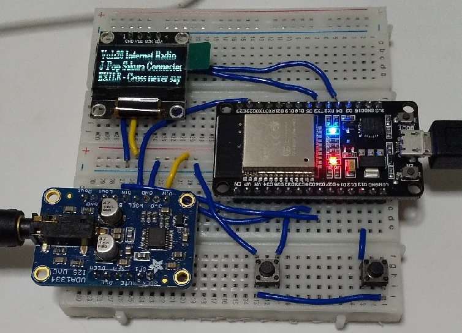
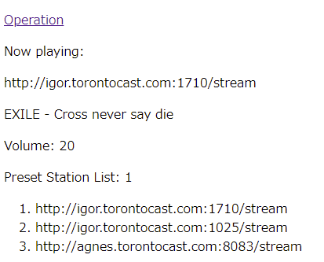
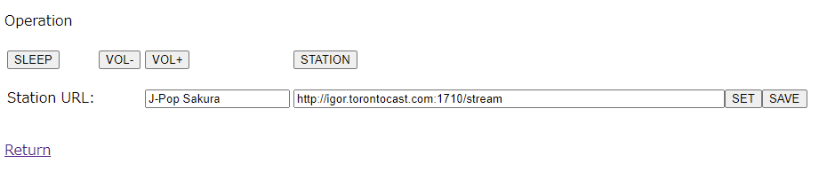

<H3>ESP32によるインターネットラジオ</H3>

MP3ストリームをI2Sデータへデコードできる<a href="https://github.com/schreibfaul1/ESP32-audioI2S">ライブラリ</a>を利用した簡単構成のインターネットラジオです。 
最小構成でESP32とI2S DACがあれば製作できます。 
Webサーバーを搭載しているので、ブラウザから操作できます（タクトスイッチも不要）。 
Arduino IDEと<a href="https://github.com/espressif/arduino-esp32">ESP32開発環境</a>が必要です。

<strong>特長</strong> 
 ・構成が簡単で安価。 
 ・WiFi接続。 
 ・MP3ストリームのインターネットラジオ局を受信できる。 
 ・ブラウザから操作できる。 
 ・ブラウザにアーティスト名、曲名が表示（日本語可）される（ある場合は表示装置（日本語不可）にも）。 
 ・インターネットラジオ局の設定はプリセットまたはURLを入力設定。 
 ・スリープタイマー（６０分）付き。 

<strong>H/W構成</strong> 
 ・ESP32 - ESP WROOM 32 DevKitC (30PINのものを推奨) 
 ・UDA1334 I2S DAC または PCM5102 I2S DAC 
 ・SD1306 128x64 OLED表示装置（オプション） 

※赤LEDはPOWER、青LEDはSLEEP ON、音量調整用のタクトスイッチ（2個）は未接続

<strong>操作</strong> 
 ・プリセットしたインターネットラジオ局の切り替え（ブラウザ／タクトスイッチ）。 
 ・音量調整（ブラウザ／タクトスイッチ）。 
 ・スリープタイマーのON/OFF（ブラウザ／タクトスイッチ）。 
 ・インターネットラジオ局のURL入力、設定と保存（ブラウザ）。 

<strong>接続</strong> 

各コンポーネントの接続は以下の通り。 
※接続PINはライブラリのオリジナルのものとは変更しているので注意 

I2S DAC
<table> 
<tr>
<td>I2S DAC(UDA1334)&nbsp;</td><td>I2S DAC(PCM5102)&nbsp;</td><td>ESP32</td>
</tr>
<tr>
<td>VIN</td><td>VIN</td><td>3V3</td>
</tr>
<tr>
<td>GND</td><td>GND</td><td>GND</td>
</tr>
<tr>
<td>WSEL</td><td>LCK</td><td>D22</td>
</td>
<tr>
<td>DIN</td><td>DIN</td><td>D25</td>
</tr>
<tr>
<td>BCLK</td><td>BCK</td><td>D26</td>
</tr>
<tr>
<td>-</td><td>SCK</td><td>GND</td>
</tr>
</table>

I2C 表示装置
<table> 
<tr>
<td>I2C&nbsp;</td><td>ESP32</td>
</tr>
<tr>
<td>VCC</td><td>3V3</td>
</tr>
<tr>
<td>GND</td><td>GND</td>
</tr>
<tr>
<td>SCK</td><td>D4</td>
<tr>
<tr>
<td>SDA</td><td>D17(TX2)</td>
<tr>
</table>

タクトスイッチ（ボタン）
※ブラウザから操作できるので無くてもOK。
<table> 
<tr>
<td>機能&nbsp;</td><td>ESP32&nbsp;</td><td>機能</td>
</tr>
<tr>
<td>SLEEP</td><td>D32</td></td><td>SLEEP機能のON/OFF</td>
</tr>
<tr>
<td>VOL-</td><td>D14</td><td>音量小（最小0）</td>
</tr>
<tr>
<td>VOL+</td><td>D12</td><td>音量大（最大20）</td>
<tr>
<tr>
<td>STATION</td><td>D13</td><td>インターネットラジオ局を「次へ」切り替え</td>
<tr>
</table>

<strong>インストール</strong> 
<ol>
<li>コードを、ZIP形式でダウンロード</li>
<li>ArduinoIDEにおいてライブラリとして導入（オリジナルのMP3-I2Sのライブラリも取り込んでいる）</li>
<li>ArduinoIDEからESP32_iradio_srv.inoを開く</li>
<li>冒頭のssid = "xxxxxxxx"; と password = "pppppppp"; の2行を 利用しているWiFiポイントのものに書き換える</li>
<li>「検証・コンパイル」に成功したら、一旦、「名前を付けて保存」を行う 
（ライブラリが不足のエラーが出たら、追加する。例えば、SD1306 OLED表示装置）
</li>
<li>上に述べたH/W構成（最小構成として、ESP32とDACが必要）を用意し、配線を接続する</li>
<li>PCとUSBケーブルで接続する。適当なCOM番号で認識される（USBのドライバが必要な場合あり）</li>
<li>「マイコンボードに書き込む」を行う</li>
<li>書き込みが成功すれば、動作の状況がシリアルモニタに表示される</li>
<li>WiFi接続時、IPアドレスがシリアルモニタに表示される。ブラウザから"http://IPアドレス"に アクセスすると以下の画面が表示される 
</li>
</ol>

インターネットラジオ局のURL、アーティスト名、曲名、VOLUMEの値、プリセット済のURLが表示されている 
「Operation」をクリックすると以下の操作画面に遷移する

各操作のボタン。「Station URL」に一時的なインターネットラジオ局のURLを指定（「SET」ボタン）でき、 受信OKの場合、「SAVE」をクリックすると保存されて、
次回のパワーオン時に自動接続する。 「STATION」ボタンをクリックすると保存が解消される

<strong>注意事項</strong> 

・回線状況、インターネットラジオ局のデータストリーム形式によっては音が途切れることがあります。 
・利用の際は、自己責任でお楽しみください。

